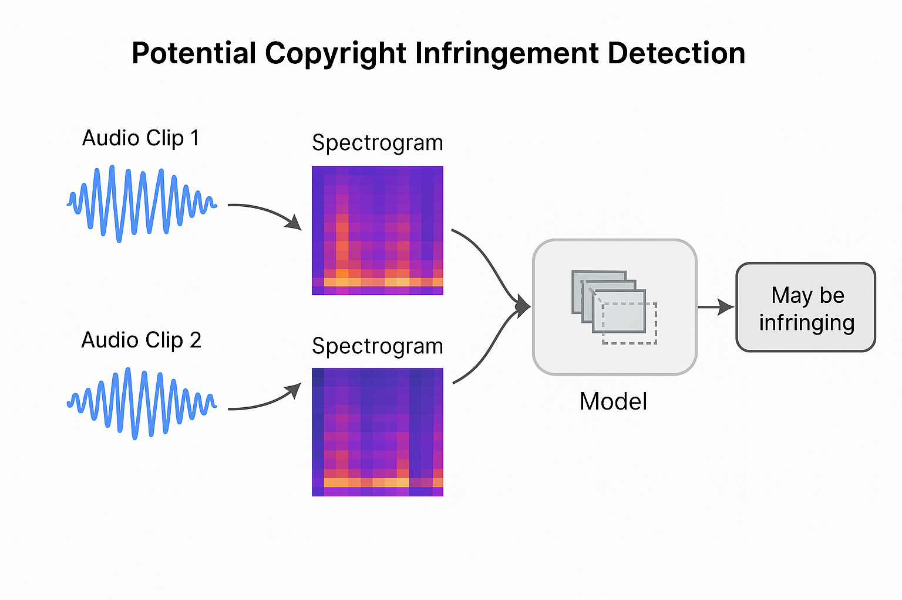

# 🎻 Fiddle – Detecting Copyright-Infringing Music Using CNNs

## What’s the problem we’re trying to solve?

Let’s say someone uploads a new song to the internet. How do we know if they just copied someone else’s music? Maybe they didn’t copy it word for word, but they:
- Slowed it down,
- Changed the pitch a little,
- Or just used a small part of it in their own track.

Right now, most platforms (like YouTube) can catch exact matches using something like Shazam’s fingerprinting. But they struggle if the audio is even slightly changed.

So we're asking:  
**Can a computer learn what “similar music” sounds like—even when it's been slightly modified—and help flag it for copyright issues?**

---

## What’s our idea?

We want to build a small AI model that looks at two short pieces of music and answers:  
**“Do these two sound very similar?”**

If the model thinks they do, maybe someone is copying or sampling. If not, probably no problem.

---

## What’s a spectrogram? And why do we use it?

Think of sound like a wave—it changes over time. But a raw sound wave is just a long list of numbers. It’s messy, and hard for a model to understand.

So instead, we turn that audio into a picture.

A **spectrogram** is like a heatmap or fingerprint of sound. It shows:
- Time (from left to right),
- Frequencies (from low to high, top to bottom),
- And how loud each frequency is at each moment (shown using color or brightness).

So now instead of raw sound, we’ve got a **visual image of the sound**. And since CNNs are really good at images, we let them work with these spectrograms.

---

## How does the model work?

We give the model **two spectrograms** (one from the original song, one from a different or modified track). The model then learns:
- If the two are from the same musical idea (like the original + a pitched version),
- Or if they’re totally unrelated.

It slowly gets better at recognizing what counts as “similar” vs. “different” based on the training data we give it.

---

## Final Goal

By the end of this project, we want:
- A trained model that takes in two short clips of music
- Outputs a similarity score or flag
- Helps identify possible copying or sampling for further review

It’s like building a smart assistant for copyright reviewers, DJs, or streaming platforms.

---

## Visual Overview

Below is a diagram showing the pipeline from audio to spectrogram, how the CNN compares two clips, and how it makes a prediction:

